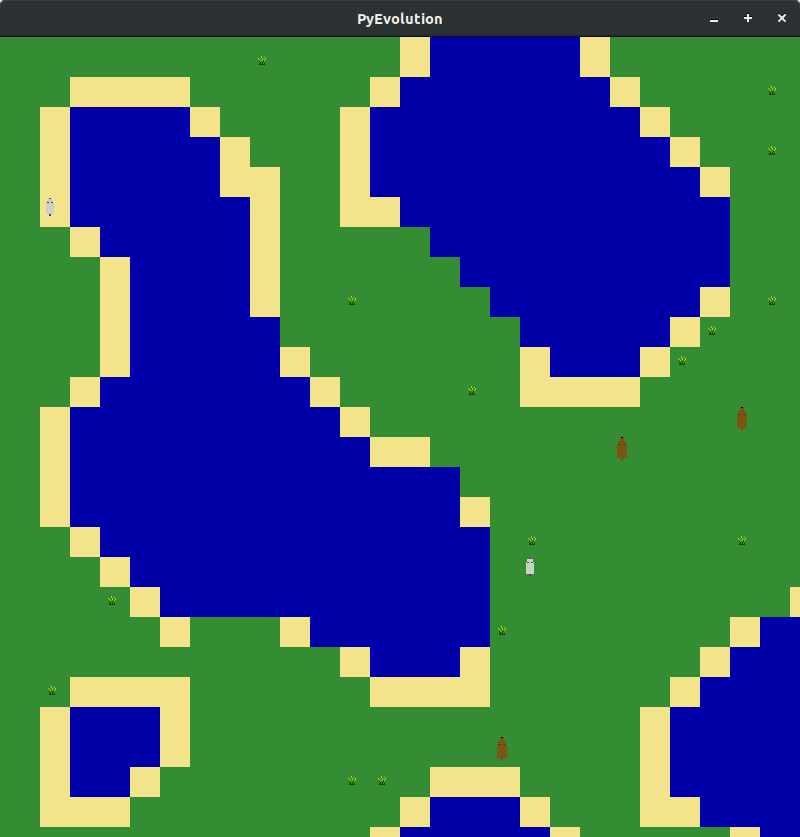

# EvolutionSimulator
Simulating a predator prey relationship in a 2D world using PyQt5. 

Inspiration for this project came from watching:

* Sebastian Lague's [Coding Adventure: Simulating an Ecosystem
](https://www.youtube.com/watch?v=r_It_X7v-1E)
* Primer's [Simulating Natural Selection](https://www.youtube.com/watch?v=0ZGbIKd0XrM)

## Installation
The supported platforms are currently Linux and Windows 10.
To run the simulation you will need to install:
* python3
* pip3
* numpy
* PyQt5
* git (reccomended)

If you would prefer not to install git and clone the repo, you can download the files from the [main repository webpage](https://github.com/kpdudek/EvolutionSimulator) by selecing the green `Code` and then `Download ZIP`.

#### *Ubuntu 18.04:*
```
sudo apt install git python3 python3-pip
git clone https://github.com/kpdudek/EvolutionSimulator.git
pip3 install PyQt5 numpy
```

#### *Windows 10:*
Download python >3.7 from the Microsoft Store and then use pip3 (included in the Microsoft Store download) to install PyQt5 and numpy.

Install git as described [here](https://www.computerhope.com/issues/ch001927.htm#:~:text=How%20to%20install%20and%20use%20Git%20on%20Windows,or%20fetching%20updates%20from%20the%20remote%20repository.%20)
```
git clone https://github.com/kpdudek/EvolutionSimulator.git
pip3 install PyQt5 numpy
```

## Running the Simulation
After installation, launch the simulation by navigating to the `EvolutionSimulator` repo you just cloned (or downloaded) and then executing the `main.py` file as follows:
```
/path/to/EvolutionSimulator> python3 main.py 
```

A window will open with a randomly generated map. To adjust the simulation settings, press `1` to show the simulation controller.


## Controls
Camera Pan : WSAD, right mouse button and drag

Center Camera : C

Open Simulation Controller : 1